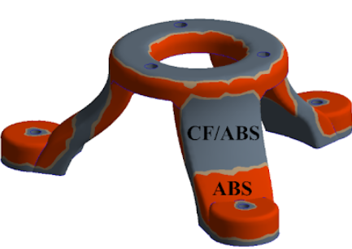

Functionally Graded Additive Manufacturing (FGAM) has been a core focus of my research, particularly during my doctoral work at Tennessee Tech University. The goal of this work was to explore the use of low-cost Fused Filament Fabrication (FFF) techniques to design, fabricate, and characterize multi-material structures with functionally graded properties.

<!--more-->

### 🔍 Objective 1: Design & Fabrication of FGMs

We developed novel digital material designs and fabricated them using FFF. These materials showed enhanced interfacial integrity compared to direct bi-material joints. Microstructural analysis and mechanical testing validated the robustness of the interface.

- **Key Insight**: Graded transitions between materials significantly reduced delamination and stress concentrations at interfaces.

### 🔍 Objective 2: Multi-Scale Modeling

We implemented three-scale homogenization and finite element modeling to study the mechanical behavior of the composites. This involved:
- Micromechanical modeling of fiber morphology.
- Mesoscale simulation of bead structure.
- Macroscale property extraction using graded isoparametric FEA.

**Result**:  
Experimental and numerical results confirmed that fiber distribution and gradient control play a critical role in stiffness and strength. Stress concentrations at direct interfaces were mitigated through graded transitions, as demonstrated in both test samples and simulations.

### ✅ Achievements:
- Developed a computational pipeline from material design to validation.
- Reduced interfacial stress concentrations by up to ~40%.
- Demonstrated manufacturing feasibility for aerospace-grade FGMs using affordable, desktop-scale FFF equipment.
- Potential applications in **biomedical**, **automotive**, and **lightweight aerospace components**.

### 🛠 Tools & Methods:
- Multiple regression for design optimization
- Homogenization and stiffness prediction
- Digital image correlation and SEM imaging for validation
- ABAQUS and Python for simulation

